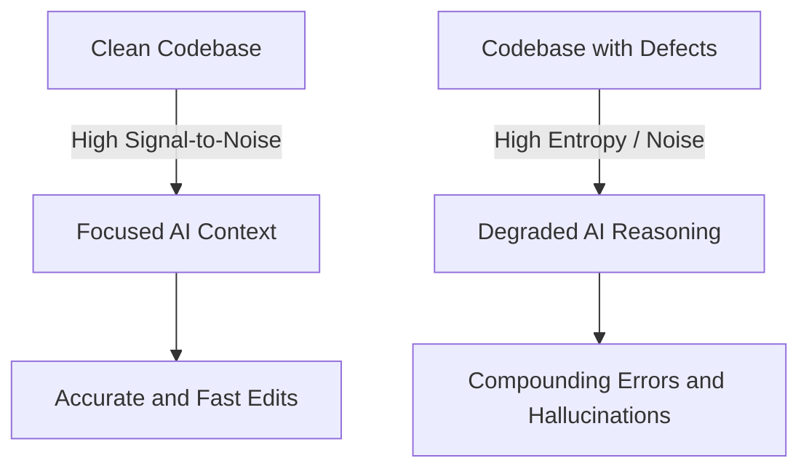

# G-006: Zero Defects and Signal-to-Noise **
*(Note: The filename must start with this exact ID, e.g., `[ID]-[pattern-name].md`)*
*(Note: Confidence Tag must be `**` for a true invariant, `*` for some progress towards an invariant, or no asterisk for a starting point)*

**Status:** Active
**Type:** General
**Domain:** Technical

*(Insert an archetypal picture or diagram that sets the context here)*

## Context
Software systems naturally drift towards complexity and unpredictability over time. In a healthy engineering culture, anytime something doesn't go as expected—whether a flaky test, an unhandled edge case, or a cryptic warning—it is immediately recognized as a sign that the underlying ecosystem needs improvement.

⋇ ⋇ ⋇

## Problem
A codebase with a high tolerance for defects, warnings, and architectural noise degrades an AI agent's ability to reason, navigate, and modify code accurately.

### Body of Problem
AI models do not possess human intuition for filtering out "normal" background noise. When an AI interacts with a codebase, its context window is populated by everything it reads—including warnings, dead code, confusing abstractions, and partially implemented hacks. If there are 50 compiler warnings, an AI might struggle to determine if the 51st warning (caused by its own edits) is relevant. Furthermore, hacks, poorly named variables, and lack of test coverage increase the entropy of the codebase. According to information theory, this entropy acts as noise that dilutes the actionable signal. The more bugs, warnings, and disclarity exist, the harder it is for both humans and AI to understand the state of the system, leading to escalating compounding errors and making simple changes exponentially more difficult.

## Solution
Mandate a Zero Defects philosophy as a core cultural commitment: treat all warnings, errors, lack of test coverage, architectural smells, and unpredictable behaviors as immediate, top-priority regressions that must be root-caused and eliminated.

### Solution Diagram
*(Insert a diagram showing the solution with labels on main components)*

### Body of Solution
As formalized in Philip Crosby's "Quality is Free," keeping operations at a very high level of execution correctness is fundamentally cheaper and faster than tolerating an "X% defect rate." For AI-assisted development, this requires a **cultural stance** on maintaining the ecosystem:

1. **Root-Cause Everything:** Never ignore a warning, intermittent test failure, or unpredictable system behavior. Anything that causes a lack of predictability is, by definition, a quality issue that must be run to the ground.
2. **Eliminate Warnings:** Configure compilers and linters to treat all warnings as errors (`-Werror`). A warning represents ambiguity, and ambiguity poisons the AI's limited ability to reason about deterministic code.
3. **Maintain High Test Coverage:** Untested code requires the AI to infer behavior stochastically rather than validating mechanically. High coverage provides deterministic guardrails.
4. **Relentless Refactoring:** Bad design is a form of debt that consumes tokens and attention span. Refactor continuously to keep the architecture aligned with its theoretical ideal.
5. **Always Leave It Better:** Treat the codebase as a shared habitat. This embodies Robert C. Martin's ("Uncle Bob") popularized "Boy Scout Rule": *Always leave the code better than you found it.* Furthermore, as Martin Fowler notes: *"Any fool can write code that a computer can understand. Good programmers write code that humans can understand."* The mere process of committing to run down all architectural smells, test flakiness, and robustness issues is a fundamental part of the cultural commitment to the ecosystem's longevity.

By maintaining this uncompromising stance, you drastically increase the signal-to-noise ratio, ensuring that when the AI enters the workspace, the problem constraints stand out in sharp relief rather than being obscured by a pile of tolerated defects.

⋇ ⋇ ⋇

## Related Smaller Patterns
This pattern depends fundamentally on [G-004: Compiler-Driven Validation](G-004-compiler-driven-validation.md) to catch deterministic errors quickly, and works in tandem with [G-040: Adversarial Verification Loops](G-040-adversarial-verification.md) to ensure that the AI constantly validates its own work against a clean baseline.
