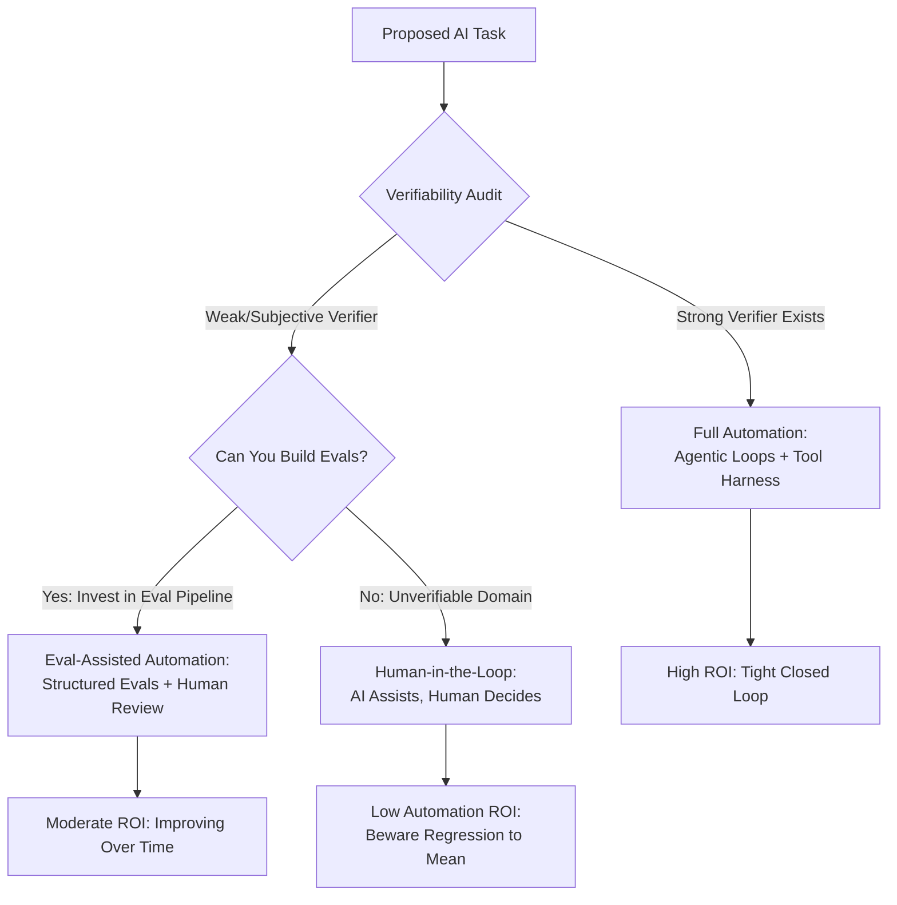

# G-007: Verifiability as Prerequisite *

**Status:** Active
**Type:** General
**Domain:** Ecosystem

## Context
The patterns in this language invest heavily in tooling, compilers, and verification loops (G-004, G-040–042) to catch AI errors. But these patterns all assume a strong verifier *already exists* for the task at hand. Before building any AI workflow, a more fundamental question must be answered first.

⋇ ⋇ ⋇

## Problem
Not all tasks are equally amenable to AI automation. The ceiling of what any closed loop—whether RL training or an agentic retry loop at inference time—can achieve is determined entirely by the quality, cost, and objectivity of the available verifier. Without recognizing this, teams invest heavily in AI workflows for domains where no strong objective function exists, then are surprised when results plateau at "mediocre."

### Body of Problem
As Andrej Karpathy has emphasized, verifiability is the single most important property determining whether AI can be made to work well on a task. This principle operates at two scales simultaneously:

- **Training time:** Reinforcement Learning (RL/RLHF) depends on a reward signal. If the reward signal is noisy, subjective, or expensive to compute, training produces models that optimize for the wrong thing or plateau quickly. The breakthroughs in code generation and mathematical reasoning are not accidents—they are domains where the objective function (compiler pass, proof checker, test suite) is cheap, fast, and unambiguous.
- **Inference time:** Agentic systems that retry, self-correct, or iteratively refine their output depend on the same principle. A compiler error is a perfect feedback signal: it's immediate, specific, and binary. A human reviewing prose quality is an expensive, slow, subjective feedback signal. The quality of the verifier determines the quality of the agentic loop.

The fundamental insight is that these are the *same principle at two scales*. A tight verifier is what makes both training and inference work.

## Solution
Before designing any AI-assisted workflow, perform a **Verifiability Audit**: evaluate whether a strong, cheap, objective function exists for the task. Use this as the primary decision gate for how much to invest in automation.

### Solution Diagram

### Body of Solution
1. **Identify the "Easy to Verify, Hard to Generate" Sweet Spot:** Tasks where output is expensive to create but cheap to objectively verify are where AI delivers the highest leverage. Code that must compile and pass tests. Data transformations with known expected outputs. Structured documents with schema validation. These are the killer apps because the closed loop is tight and cheap.

2. **For Subjective Domains, Invest in Evals:** When verification is inherently subjective (prose quality, UX design, strategic decisions), the task isn't hopeless—but the path forward requires building structured evaluation pipelines that approximate an objective function. Evals with rubrics, A/B testing frameworks, and calibrated human review panels can convert "vibes" into measurable signals. The investment in building these evals *is* the investment in making AI work for the domain (→ see G-008).

3. **Accept the Limits of Unverifiable Domains:** Some tasks lack any practical objective function—and no eval pipeline can be cheaply built. For these, AI will reliably produce "regression to the mean" output. Use AI as an assistant in these domains, not an autonomous agent. The human must remain the decision-maker.

4. **Apply at Architecture Time:** This audit should happen during system design, not as an afterthought. The verifiability of a task should influence whether you build an agentic loop, a human-review workflow, or a fully manual process. Over-automating an unverifiable task wastes engineering effort and produces mediocre results.

⋇ ⋇ ⋇

## Related Smaller Patterns
This pattern is the parent principle for [G-004: Compiler-Driven Validation](G-004-compiler-driven-validation.md), which instantiates verifiability using the compiler as the objective function, and [G-042: Tool-Driven Correctness](G-042-tool-driven-correctness.md), which generalizes to hard-harnessed tooling as the verifier. [G-008: Eval-Driven System Design](G-008-eval-driven-system-design.md) addresses the complementary challenge of designing systems to *capture* the data needed to power evaluation pipelines, enabling verifiability even in domains that don't naturally provide cheap objective functions.
